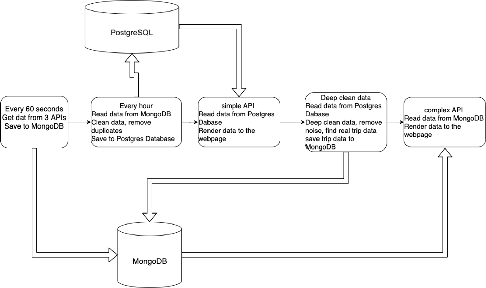
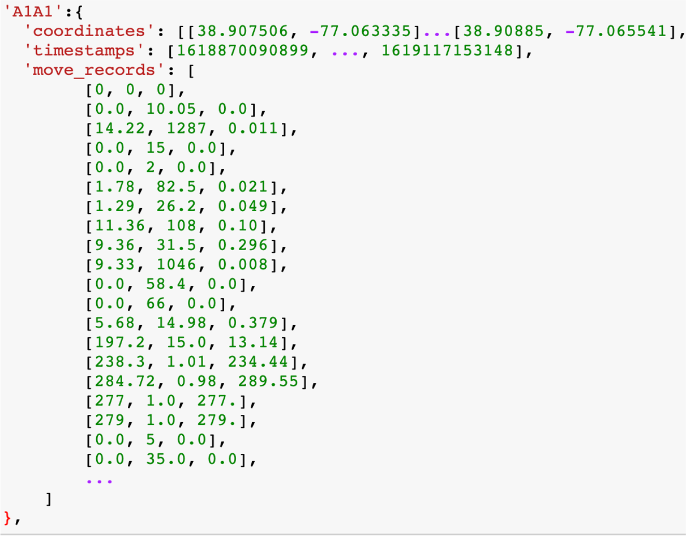
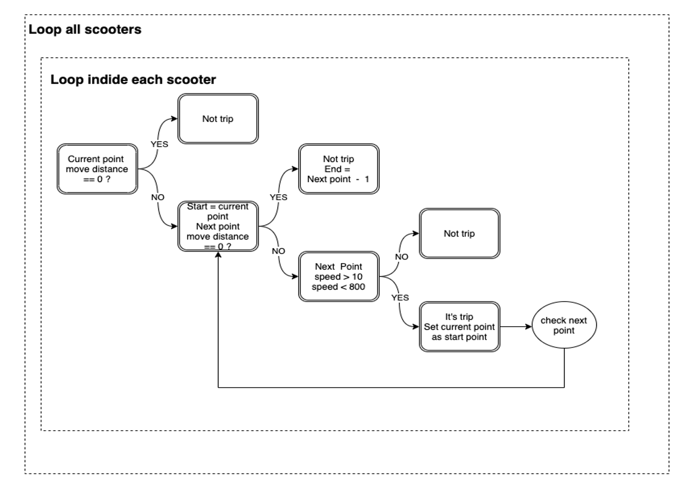

# DC Scooters Data Analytics
## Introduction
### Backend
- This project retrieves scooter opertion data from the open API of 3 companies (Spin, Razor, Helbiz) and dump the raw data into MongoDB every minute. The data include scooter id, latitude, longitude, timestamp. 
- The app reads data from MongoDB every hour. Then clean data, such as remove duplicates, and save the clean data into PostgreSQL.
- Provide scooter data API based on clean data in PostgreSQL
- Find the real scooter trips based on the clean data in PostgreSQL. Save the trip data to MongoDB
- Provide scooter trips API based on the trip data in MongoDB.

### Project Structure
- The project is divided into backend and frontend. Each has its own repo. They are independent.
The frontend communicate with backend through API call.
- Front-end 
    - webpage: https://simon-xu-lan.github.io/data-project2-scooters-frontend/
    - github: https://github.com/Simon-Xu-Lan/data-project2-scooters-frontend
- Back-end 
    - webpage: http://scooters.pythonanywhere.com/
    - github: https://github.com/Simon-Xu-Lan/project2-scooters-api

## Data Process

## Data Clean Process
- Raw Data: 4 days data, 3,230,000 records
- Clean Data: 521,456 records
- Trip data: 7,621 scooter trips

## Find scooter trips
- Group data by bike_id
- Calculate the following between adjacent lat and lon
    - Distance (meter)
    - Time (minutes)
    - Speed ( meter per minute)
- Data example

- Algorithm flow chart

## App Structure
### Back-end
- Scheduler
    - Python
    - APScheduler
    - Every hour to clean data and save to Postgres 
    - Run on console
- Web App
    - Python
    - Flask
    - Retrieve data from MongoDB and PostgreSQL
    - Serve API route
- Data Clean
    - Python
    - Pandas
    - Customized algorithm
    - MongoDB
### Front-end
- Dashboard
    - JavaScript
    - D3
    - Leaflet

## Host and Deploy
- Back end API
    - Pythonanywhere
- PostgreSQL database
    - Heroku
- MongoDB
    - Atlas

## MongoDB vs SQL DB
### MongoDB
- Faster on retrieve data and save data
- Structure is good for nested JSON structure
    - Good for API service
- Less calculation functions
    - Such as MIN(), MAX(), AVERAGE(), DISTINCT, ORDER BY, GROUP BY
### SQL DB
- Suitable for table structure data
- Powerful functionality
    - SQL 
    - Functions: MIN(), MAX(), AVERAGE() …
- Not suitable for nested JSON structure
    - Slower for complex API data service
